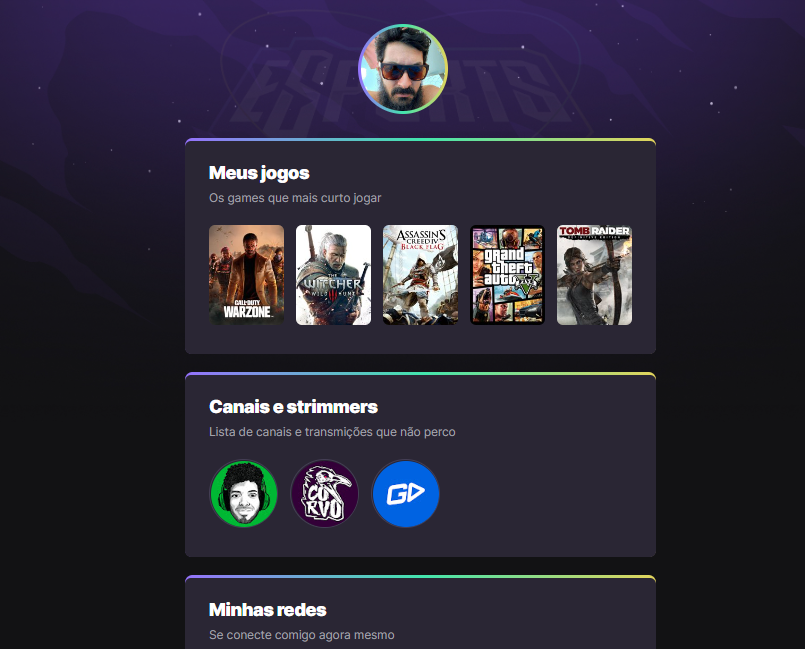

# NLW eSports  

>Trilha Explorer

Projeto construido no event Next Level Week da Rocketseat.

[🔗 Click aqui para acessar](https://edysilva27.github.io/NLW/)

## Objetivos

- Criar uma página com links externos e imagens diponíveis na internet.
- Estilizar e animar a página através do CSS.
- Adicionar o código ao Github como repositório público.

## 🔧 Tecnoligias

- HTML5
- CSS
- Git e Github